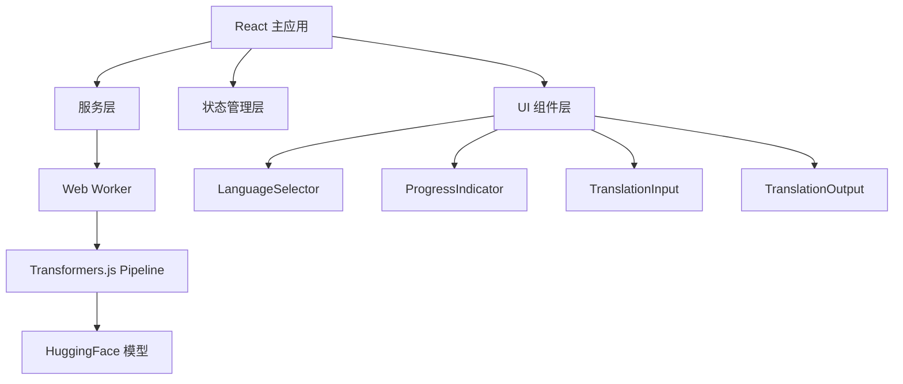

# 设计文档

## 概述

智语通翻译应用采用现代前端架构，结合机器学习技术实现浏览器端的文本翻译功能。系统采用分层架构设计，通过 Web Worker 实现计算密集型任务的异步处理，确保用户界面的响应性。

## 架构

### 整体架构



### 技术栈

- **前端框架**: React 18+ (使用 Hooks)
- **机器学习**: Transformers.js
- **多线程**: Web Worker + MessageChannel
- **状态管理**: React Context + useReducer
- **构建工具**: Vite
- **类型检查**: TypeScript

## 组件和接口

### 核心组件

#### 1. App 组件
主应用组件，负责整体布局和状态管理。

```typescript
interface AppState {
  sourceLanguage: string;
  targetLanguage: string;
  inputText: string;
  translatedText: string;
  isTranslating: boolean;
  progress: number;
  error: string | null;
}
```

#### 2. LanguageSelector 组件
参数化语言选择器，支持多种配置。

```typescript
interface LanguageSelectorProps {
  value: string;
  onChange: (language: string) => void;
  languages: Language[];
  label: string;
  disabled?: boolean;
}

interface Language {
  code: string;
  name: string;
  nativeName: string;
}
```

#### 3. ProgressIndicator 组件
动态进度指示器，显示模型加载和翻译进度。

```typescript
interface ProgressIndicatorProps {
  progress: number;
  message: string;
  isVisible: boolean;
  variant?: 'linear' | 'circular';
}
```

#### 4. TranslationService
翻译服务类，管理 Web Worker 通信。

```typescript
class TranslationService {
  private worker: Worker;
  private messageChannel: MessageChannel;
  
  async translate(text: string, from: string, to: string): Promise<string>;
  onProgress(callback: (progress: number) => void): void;
  destroy(): void;
}
```

### Web Worker 接口

#### ModelManager (Worker 内)
单例模式管理模型管道。

```typescript
class ModelManager {
  private static instance: ModelManager;
  private pipelines: Map<string, any>;
  
  static getInstance(): ModelManager;
  async getPipeline(task: string, model: string): Promise<any>;
  private async loadModel(model: string): Promise<any>;
}
```

## 数据模型

### 翻译请求模型

```typescript
interface TranslationRequest {
  text: string;
  sourceLanguage: string;
  targetLanguage: string;
  options?: {
    maxLength?: number;
    temperature?: number;
  };
}
```

### 翻译响应模型

```typescript
interface TranslationResponse {
  translatedText: string;
  confidence?: number;
  processingTime: number;
}
```

### 进度事件模型

```typescript
interface ProgressEvent {
  type: 'model-loading' | 'translating';
  progress: number;
  message: string;
}
```

## 错误处理

### 错误类型定义

```typescript
enum TranslationErrorType {
  MODEL_LOAD_FAILED = 'MODEL_LOAD_FAILED',
  TRANSLATION_FAILED = 'TRANSLATION_FAILED',
  WORKER_ERROR = 'WORKER_ERROR',
  NETWORK_ERROR = 'NETWORK_ERROR'
}

interface TranslationError {
  type: TranslationErrorType;
  message: string;
  details?: any;
}
```

### 错误处理策略

1. **模型加载失败**: 显示错误信息，提供重试按钮
2. **翻译失败**: 显示具体错误原因，允许用户修改输入重试
3. **Worker 错误**: 重新初始化 Worker，恢复服务
4. **网络错误**: 检查网络连接，提供离线提示

## 测试策略

### 单元测试
- 组件渲染测试
- 状态管理逻辑测试
- 工具函数测试
- Mock Web Worker 测试

### 集成测试
- 翻译流程端到端测试
- Web Worker 通信测试
- 错误处理流程测试

### 性能测试
- 模型加载时间测试
- 翻译响应时间测试
- 内存使用监控
- 并发翻译测试

## 实现细节

### 单例模式实现
ModelManager 使用单例模式确保模型实例的唯一性，避免重复加载。

### Web Worker 通信
使用 MessageChannel 建立双向通信通道，实现主线程与 Worker 线程的解耦。

### 组件复用策略
通过 Props 驱动的参数化设计，实现 UI 组件在不同功能模块间的复用。

### 性能优化
- 模型预加载和缓存
- 防抖处理用户输入
- 虚拟化长文本显示
- 组件懒加载